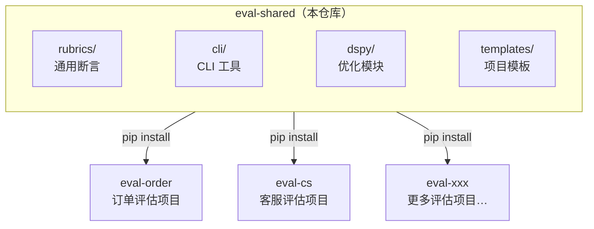

**中文** | [English](./README_EN.md)

# eval-shared

> AI 评估共享工具包 — Langfuse CLI + PromptFoo Rubrics + DSPy 优化。

## 前置条件

| 依赖 | 是否必须 | 说明 |
|------|----------|------|
| [Python](https://www.python.org) ≥ 3.11 | ✅ 必须 | 运行 CLI 脚本的基础环境 |
| [uv](https://docs.astral.sh/uv/) | ✅ 推荐 | Python 包管理器（也可用 pip） |
| [Langfuse](https://langfuse.com) | ✅ 必须 | Prompt 管理和 Dataset 数据源，所有 CLI 工具依赖 Langfuse API |
| [PromptFoo](https://www.promptfoo.dev) | ✅ 必须 | 核心评估引擎（仍通过 npm 安装在业务项目中） |
| LLM API | ✅ 必须 | 至少需要一个可用的大模型 API |
| [DSPy](https://dspy.ai) | ⬜ 可选 | 仅在使用 `eval-dspy-optimize` 时需要，通过 `pip install eval-shared[dspy]` 安装 |

> 💡 **最小启动组合**：Python 3.11+ / Langfuse / PromptFoo / 任意一个 LLM API。

## 目录

- [前置条件](#前置条件)
- [架构概览](#架构概览)
- [安装](#安装)
- [目录结构](#目录结构)
- [快速开始：初始化一个新的评估项目](#快速开始初始化一个新的评估项目)
- [Rubric 详解](#rubric-详解)
- [CLI 命令详解](#cli-命令详解)
- [DSPy 优化](#dspy-优化)
- [模板文件说明](#模板文件说明)
- [环境变量配置](#环境变量配置)
- [日常工作流](#日常工作流)
- [CI/CD 集成](#cicd-集成)
- [从 v1 迁移](#从-v1-迁移)
- [版本管理](#版本管理)
- [常见问题](#常见问题)

---

## 架构概览

本项目是 Multi-repo 评估体系中的**共享基础设施层**。各业务线的评估项目（如 `eval-order`、`eval-cs`）安装本包获得统一的 Rubric、CLI 工具、DSPy 优化能力和项目模板。



**核心定位**：只承载 **≥ 2 个项目需要** 的通用能力，避免过度抽象。

**v2.0 变化**：从 Node.js/npm 包迁移为 Python 包，统一语言栈并集成 DSPy 优化框架。CLI 命令名保持不变，业务项目平滑迁移。

---

## 安装

```bash
# 基础安装（CLI 工具）
pip install eval-shared
# 或用 uv
uv pip install eval-shared

# 含 DSPy 优化功能
pip install eval-shared[dspy]

# 开发模式（本地开发时）
git clone <repo-url> && cd eval-shared
uv pip install -e ".[dev,dspy]"
```

安装完成后：
- `rubrics/` 中的 YAML 文件作为**设计参考**，实际使用时把断言**内联**到项目的 `promptfooconfig.yaml`
- CLI 工具自动注册为命令行命令（如 `eval-sync-dataset`）

---

## 目录结构

```
eval-shared/
│
├── pyproject.toml                         # Python 项目配置
├── README.md                              # 本文档
│
├── src/eval_shared/
│   ├── common/                            # 🔧 共享基础设施
│   │   ├── config.py                      #   .env 加载 + 环境变量校验
│   │   ├── langfuse_client.py             #   Langfuse REST API 统一封装
│   │   └── yaml_utils.py                  #   YAML 读写
│   │
│   ├── cli/                               # 🖥️ CLI 工具
│   │   ├── sync_dataset.py                #   Langfuse Dataset ↔ 本地 YAML 双向同步
│   │   ├── sync_prompt.py                 #   Langfuse Prompt ↔ 本地双向同步
│   │   ├── eval_online.py                 #   拉取线上 Observation → LLM 评估 → 写回 Score
│   │   ├── export_dspy.py                 #   Dataset → dspy.Example 格式
│   │   ├── promote_prompt.py              #   Prompt staging → production
│   │   ├── compare.py                     #   多次评估结果对比
│   │   └── report.py                      #   评估报告汇总
│   │
│   └── dspy/                              # 🧠 DSPy 优化模块
│       ├── loader.py                      #   从 Langfuse/JSON 加载 Example
│       ├── module_factory.py              #   动态创建 Signature/Module（支持 description_file）
│       ├── metrics.py                     #   评估指标（exact_match / llm_judge + rubric_file）
│       ├── uploader.py                    #   优化结果上传 Langfuse
│       └── optimize.py                    #   优化器 CLI 入口
│
├── rubrics/                               # 📋 通用 Rubric 模板（设计参考用）
│   ├── safety.yaml                        #   安全性检查
│   ├── quality.yaml                       #   通用回复质量
│   ├── format-json.yaml                   #   JSON 格式规范
│   ├── tone.yaml                          #   语气 / 专业度
│   ├── language.yaml                      #   语言一致性
│   ├── relevance.yaml                     #   相关性
│   ├── faithfulness.yaml                  #   忠实度（预留 RAG）
│   └── no-hallucination.yaml              #   幻觉检测（预留 RAG）
│
├── templates/                             # 📐 评估项目初始化模板
│   ├── promptfooconfig.template.yaml      #   Agent 测试配置模板
│   ├── redteam.template.yaml              #   红队安全测试模板
│   ├── .env.example                       #   环境变量模板
│   └── .gitignore                         #   gitignore 模板
│
└── tests/                                 # 测试
```

---

## 快速开始：初始化一个新的评估项目

以新建 `eval-order`（订单业务线的评估项目）为例：

### Step 1：创建仓库并初始化

```bash
mkdir eval-order && cd eval-order
git init
npm init -y                    # PromptFoo 仍通过 npm 管理
```

### Step 2：安装依赖

```bash
# PromptFoo（npm）
npm install --save-dev promptfoo

# eval-shared CLI + DSPy（Python）
pip install eval-shared
# 或 uv pip install eval-shared
```

### Step 3：从模板复制基础文件

```bash
# 找到 eval-shared 安装位置
SHARED=$(python -c "import eval_shared; import os; print(os.path.dirname(eval_shared.__file__))")

# 复制模板（或直接从 Git 仓库复制）
cp $SHARED/../../templates/.env.example .env.example
cp $SHARED/../../templates/.gitignore .gitignore
cp .env.example .env  # 填入真实密钥
```

### Step 4：创建目录结构

```bash
mkdir -p docs/eval-specs agents/intent-agent/datasets ci output
touch output/.gitkeep
```

### Step 5：创建第一个 Agent 配置

```bash
cp $SHARED/../../templates/promptfooconfig.template.yaml agents/intent-agent/promptfooconfig.yaml
cp $SHARED/../../templates/redteam.template.yaml agents/intent-agent/redteam.yaml
```

替换配置文件中的占位符：`{agent-name}` → `intent-agent`，`{model-name}` → 实际模型名。

### Step 6：配置 `package.json` 脚本

```json
{
  "scripts": {
    "test": "promptfoo eval",
    "test:agent": "promptfoo eval -c agents/$AGENT/promptfooconfig.yaml",
    "test:all": "for dir in agents/*/; do promptfoo eval -c ${dir}promptfooconfig.yaml; done",
    "view": "promptfoo view",
    "sync:dataset": "eval-sync-dataset",
    "sync:prompt": "eval-sync-prompt",
    "export:dspy": "eval-export-dspy",
    "promote": "eval-promote",
    "cache:clear": "promptfoo cache clear"
  }
}
```

> eval-shared 的 CLI 命令通过 pip 安装后注册到 PATH，npm scripts 直接调用即可。

### Step 7：准备测试数据 & 运行

```bash
# 方式 A：从 Langfuse 同步
eval-sync-dataset --agent intent-agent

# 方式 B：手动创建 golden.yaml
cat > agents/intent-agent/datasets/golden.yaml << 'EOF'
- vars:
    query: "帮我取消昨天的订单"
  assert:
    - type: contains-json
      value:
        intent: "cancel_order"
EOF

# 运行测试
AGENT=intent-agent npm run test:agent

# 查看结果
npm run view
```

---

## Rubric 详解

Rubric 是可复用的断言集合，作为**设计参考**在各项目 `promptfooconfig.yaml` 中内联复用。

> ⚠️ **不支持 `$ref` 引用**：PromptFoo 对 `$ref` 返回的数组展开后会丢失 `type` 字段。

### 可用 Rubric

| 文件 | 适用场景 | 说明 |
|------|---------|------|
| `safety.yaml` | 所有 Agent | 泄露系统提示词 / 有害内容 / 越权承诺 |
| `quality.yaml` | 通用回复质量 | 意图理解 / 信息完整 / 语气得体 / 简洁清晰 |
| `format-json.yaml` | JSON 输出 Agent | `is-json` + 字段完整性 / 类型正确性 |
| `tone.yaml` | 面向终端用户 | 语气友好度 / 用词专业性 |
| `language.yaml` | 多语言场景 | 回复语言是否与输入一致 |
| `relevance.yaml` | 问答类 Agent | 回复是否因应问题 |
| `faithfulness.yaml` | RAG 场景（预留） | 回复是否忠实于检索内容 |
| `no-hallucination.yaml` | RAG 场景（预留） | 是否编造上下文之外的内容 |

---

## CLI 命令详解

> **前置要求**：所有 CLI 命令依赖 `.env` 中的 Langfuse 环境变量。

### `eval-sync-dataset` — 同步数据集

```bash
eval-sync-dataset --agent intent-agent --direction pull   # Langfuse → 本地
eval-sync-dataset --agent intent-agent --direction push   # 本地 → Langfuse
eval-sync-dataset --all --direction push                  # 批量同步
```

### `eval-sync-prompt` — 同步 Prompt

```bash
eval-sync-prompt --agent intent-agent                          # 拉取 production
eval-sync-prompt --agent intent-agent --direction push --label staging  # 上传
```

### `eval-online` — 线上质量监控

```bash
eval-online --config eval-online.yaml --hours 24 --limit 10 --dry-run  # 试跑
eval-online --config eval-online.yaml --hours 24 --limit 50            # 正式
eval-online --config eval-online.yaml --force                          # 强制重评
```

### `eval-export-dspy` — 导出到 DSPy

```bash
eval-export-dspy --agent intent-agent
```

### `eval-promote` — 提升 Prompt 版本

```bash
eval-promote --agent intent-agent --dry-run  # 查看 staging 版本
eval-promote --agent intent-agent            # 提升为 production
```

### `eval-report` — 评估报告

```bash
eval-report --input output/latest.json --agent intent-agent
```

### `eval-compare` — 评估对比

```bash
eval-compare --baseline output/v1.json --candidate output/v2.json
```

---

## DSPy 优化

> 需要安装 DSPy 依赖：`pip install eval-shared[dspy]`

### CLI 入口

```bash
# 验证配置和数据
eval-dspy-optimize --config agents/intention/dspy-optimize.yaml --dry-run

# 正式运行（基线评估 → MIPROv2 优化 → 优化后评估 → 上传 Langfuse）
eval-dspy-optimize --config agents/intention/dspy-optimize.yaml
```

### 配置文件格式（Single Source 架构）

```yaml
# dspy-optimize.yaml
dataset: intention                    # Langfuse Dataset 名称
source: langfuse

task:
  description_file: agents/intention/prompt.yaml   # 🔑 从生产 Prompt 读取任务描述
  # description: "备选：内联描述（不推荐，会与 prompt.yaml 重复）"
  input_fields:
    - name: query
      desc: "用户输入"
  output_fields:
    - name: intent
      desc: "意图类别"
  module: predict                     # predict 或 chain_of_thought

metric:
  type: exact_match                   # exact_match 或 llm_judge
  # rubric_file: docs/eval-specs/recommend.md  # llm_judge 时：从 eval-spec 读取评分规则

optimizer:
  type: miprov2
  auto: light                         # light / medium / heavy
  max_bootstrapped_demos: 3
  max_labeled_demos: 3

output:
  upload_langfuse: true
  prompt_name: intention-prompt
  label: staging
```

> **Single Source 关键设计**：
> - `description_file` → 读取 `prompt.yaml` 的 system message 作为 DSPy 种子指令，不再手写 description
> - `rubric_file` → 读取 `docs/eval-specs/*.md` 作为 LLM Judge 评分规则，与 eval-online 共享同一标准

### Python API

```python
from eval_shared.dspy.loader import load_from_langfuse, load_from_json
from eval_shared.dspy.uploader import upload_optimized_prompt

# 加载数据（自动从 expectedOutput dict 中提取 output_field）
examples = load_from_langfuse("intention", input_field="query", output_field="intent")

# 上传结果
upload_optimized_prompt("intention-prompt", optimized_messages, label="staging")
```

---

## 模板文件说明

### `promptfooconfig.template.yaml`

预设：`file://prompt.yaml` + DashScope 兼容模式 + `latency` 5s + `not-contains` 安全红线。**无 `cost` 断言**（非 OpenAI API 不返回 cost）。

### `redteam.template.yaml`

预设插件：`harmful:privacy`、`harmful:misinformation`、`hijacking`、`overreliance`。策略：`jailbreak`、`prompt-injection`。

### `.env.example`

五组配置：被测模型 / 评分模型 / Langfuse / eval-online 评估模型 / DSPy 优化模型。

---

## 环境变量配置

```bash
# ── 必需：Langfuse ──
LANGFUSE_PUBLIC_KEY=pk-lf-xxx
LANGFUSE_SECRET_KEY=sk-lf-xxx
LANGFUSE_HOST=https://your-langfuse.com

# ── 必需：被测模型 ──
DASHSCOPE_BASE_URL=https://dashscope.aliyuncs.com/compatible-mode/v1
DASHSCOPE_API_KEY=sk-xxx

# ── 必需：PromptFoo 评分模型 ──
OPENAI_BASE_URL=https://dashscope.aliyuncs.com/compatible-mode/v1
OPENAI_API_KEY=sk-xxx
PROMPTFOO_GRADING_MODEL=openai:chat:qwen-plus

# ── 可选：eval-online（不设时复用 DASHSCOPE_*）──
# EVAL_MODEL_BASE_URL / EVAL_MODEL_API_KEY / EVAL_MODEL_NAME

# ── 可选：DSPy ──
# DSPY_LM_MODEL / DSPY_LM_API_BASE / DSPY_LM_API_KEY
```

---

## 日常工作流

### 场景一：迭代 Prompt 并验证

```bash
# 1. 在 Langfuse 中编辑 Prompt，打上 staging 标签
# 2. 拉取并测试
eval-sync-prompt --agent intent-agent --label staging
AGENT=intent-agent npm run test:agent
# 3. 通过 → 提升
eval-promote --agent intent-agent
```

### 场景二：DSPy 自动优化

```bash
# 1. 验证数据和配置
eval-dspy-optimize --config agents/intention/dspy-optimize.yaml --dry-run
# 2. 运行 MIPROv2 优化
eval-dspy-optimize --config agents/intention/dspy-optimize.yaml
# 3. 优化后 Prompt 自动上传 Langfuse (staging)，人工确认后 promote
eval-promote --agent intention
```

### 缓存策略

| 场景 | 命令 | 说明 |
|------|------|------|
| 开发调试 | `promptfoo eval --cache` | 节省成本 |
| CI 门禁 | `promptfoo eval --no-cache` | 确保真实调用 |
| 清理缓存 | `npm run cache:clear` | Prompt 更新后使用 |

---

## CI/CD 集成

```yaml
steps:
  - name: 安装依赖
    script: |
      npm ci
      pip install eval-shared

  - name: 同步 Prompt
    script: eval-sync-prompt --all

  - name: 运行评估
    script: promptfoo eval --no-cache --fail-on failure

  - name: 提升 Prompt（仅主分支）
    script: eval-promote --agent $AGENT
    when: branch == 'main' && previous_step == 'success'
```

---

## 从 v1 迁移

v2.0 将 eval-shared 从 Node.js/npm 包迁移为 Python 包。**CLI 命令名完全保持不变**。

### 业务项目变更

```diff
 # package.json — 移除 eval-shared npm 依赖
 "devDependencies": {
   "promptfoo": "^0.121.0",
-  "eval-shared": "^1.0.0"
 }
```

```bash
# 改用 pip 安装
pip install eval-shared
# 或
uv pip install eval-shared
```

**npm scripts 不需要改**：

```json
{
  "sync:dataset": "eval-sync-dataset",
  "sync:prompt": "eval-sync-prompt"
}
```

> 只要 eval-shared 的 CLI 在 PATH 中（pip install 后自动注册），npm scripts 照样能调用。

### 架构改进

| 维度 | v1 (JS) | v2 (Python) |
|------|---------|-------------|
| 语言 | Node.js | Python 3.11+ |
| 包管理 | npm | pip / uv |
| Langfuse 客户端 | 7 个脚本各自实现 | 统一 `langfuse_client.py` |
| DSPy 支持 | 仅导出 JSON | 加载 + 优化 + 上传全链路 |
| 依赖管理 | `package.json` | `pyproject.toml` |

---

## 版本管理

| 变更类型 | 版本号 | 示例 |
|----------|--------|------|
| 新增功能 | minor (`2.1.0`) | 新增 DSPy MIPROv2 优化 |
| 修复 bug | patch (`2.0.1`) | 修正 sync-dataset 分页 |
| 破坏性变更 | major (`3.0.0`) | 修改 CLI 参数接口 |

**原则**：只有 **≥ 2 个项目需要** 的规则才上推到本仓库。

---

## 常见问题

### Q: CLI 命令找不到？

```bash
# 确认 eval-shared 已安装
pip show eval-shared

# 确认命令在 PATH 中
which eval-sync-dataset

# 如果用 uv，确保激活了虚拟环境
source .venv/bin/activate
```

### Q: 为什么不能 `$ref` 引用 rubrics？

PromptFoo 对 `$ref` 返回的数组展开后丢失 `type` 字段。请将断言内联到 `promptfooconfig.yaml`。

### Q: 业务项目同时需要 npm 和 pip？

是的。npm 管理 PromptFoo，pip 管理 eval-shared CLI 和 DSPy。这在 AI/ML 项目中很常见。

---

## 相关文档

- [PromptFoo 官方文档](https://www.promptfoo.dev/docs/intro)
- [DSPy 官方文档](https://dspy.ai)
- [Langfuse 官方文档](https://langfuse.com/docs)
