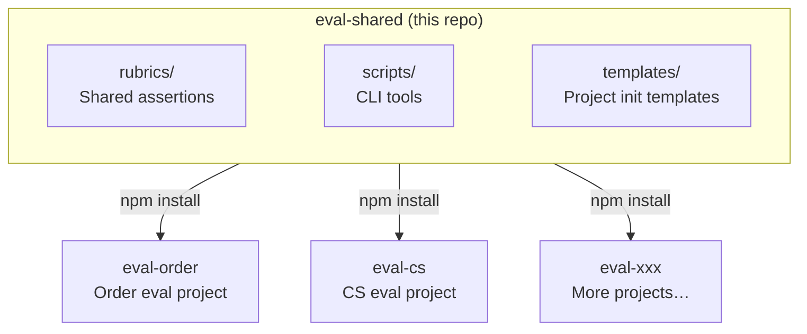

[中文](./README.md) | **English**

# eval-shared

> PromptFoo eval shared toolkit — shared infrastructure for all evaluation projects.

## Prerequisites

Before using this project, make sure your environment meets the following requirements:

| Dependency | Required | Description |
|------------|----------|-------------|
| [Langfuse](https://langfuse.com) | ✅ Required | Serves as the Prompt management and Dataset source. All CLI tools (sync dataset, sync prompt, promote) depend on the Langfuse API |
| [PromptFoo](https://www.promptfoo.dev) | ✅ Required | Core evaluation engine for running tests, scoring, and generating reports |
| [Node.js](https://nodejs.org) ≥ 18 | ✅ Required | Runtime environment for CLI scripts and PromptFoo |
| LLM API | ✅ Required | At least one LLM API (OpenAI, Qwen, etc.) for PromptFoo providers and LLM-as-Judge scoring |
| [LiteLLM](https://litellm.ai) | ⬜ Optional | Recommended if you need a unified proxy for multiple model APIs; PromptFoo can connect to model APIs directly without it |
| [DSPy](https://dspy.ai) | ⬜ Optional | Only needed for automatic Prompt optimization; used by the `export-to-dspy` command |

> 💡 **Minimum setup**: Langfuse + PromptFoo + any LLM API is all you need to run the full evaluation pipeline.

## Table of Contents

- [Prerequisites](#prerequisites)
- [Architecture](#architecture)
- [Installation](#installation)
- [Directory Structure](#directory-structure)
- [Quick Start: Initialize a New PromptFoo Evaluation Project](#quick-start-initialize-a-new-promptfoo-evaluation-project)
- [Rubrics](#rubrics)
- [CLI Commands](#cli-commands)
- [Template Files](#template-files)
- [Environment Variables](#environment-variables)
- [Daily Workflows](#daily-workflows)
- [CI/CD Integration](#cicd-integration)
- [Versioning](#versioning)
- [FAQ](#faq)

---

## Architecture

This project is the **shared infrastructure layer** in a multi-repo evaluation system. Each business line's PromptFoo evaluation project (e.g., `eval-order`, `eval-cs`) installs this package via npm to get unified Rubrics, CLI tools, and project templates.

> **What is an "evaluation project"?** Each evaluation project is an independent Git repository that uses [PromptFoo](https://www.promptfoo.dev) to run automated tests and quality evaluations on AI Agents for a specific business line. A single evaluation project can contain test configurations for multiple Agents.



**Core principle**: Only include capabilities needed by **≥ 2 projects** — avoid over-abstraction.

---

## Installation

In your PromptFoo evaluation project, run:

```bash
npm install --save-dev eval-shared
```

After installation:
- YAML files in `rubrics/` can be referenced via `$ref` in your `promptfooconfig.yaml`
- CLI tools in `scripts/` are automatically registered as commands (e.g., `eval-sync-dataset`)

---

## Directory Structure

```
eval-shared/
│
├── package.json                        # Package name: eval-shared
├── README.md                           # Chinese documentation
├── README_EN.md                        # English documentation (this file)
│
├── rubrics/                            # 📋 Shared Rubric templates
│   ├── safety.yaml                     #   Safety checks (recommended for all Agents)
│   ├── quality.yaml                    #   General response quality
│   ├── format-json.yaml                #   JSON format validation
│   └── tone.yaml                       #   Tone / professionalism
│
├── scripts/                            # 📜 CLI tool scripts
│   ├── sync-dataset.js                 #   Langfuse Dataset → local YAML
│   ├── sync-prompt.js                  #   Langfuse Prompt ↔ local sync
│   ├── export-to-dspy.js               #   Dataset → dspy.Example format
│   └── promote-prompt.js               #   Prompt staging → production
│
└── templates/                          # 📐 PromptFoo evaluation project init templates
    ├── promptfooconfig.template.yaml   #   Agent test config template
    ├── redteam.template.yaml           #   Red team security test template
    ├── .env.example                    #   Environment variable template
    └── .gitignore                      #   gitignore template
```

---

## Quick Start: Initialize a New PromptFoo Evaluation Project

Using `eval-order` (an evaluation project for the order business line) as an example, here's the complete flow from zero to running tests:

### Step 1: Create Repository

```bash
mkdir eval-order && cd eval-order
git init
npm init -y
```

### Step 2: Install Dependencies

```bash
npm install --save-dev promptfoo eval-shared
```

### Step 3: Copy Template Files

```bash
# Copy environment variable template and gitignore
cp node_modules/eval-shared/templates/.env.example .env.example
cp node_modules/eval-shared/templates/.gitignore .gitignore

# Copy .env.example to .env and fill in real credentials
cp .env.example .env
```

### Step 4: Create Directory Structure

```bash
mkdir -p docs/eval-specs
mkdir -p agents/intent-agent/datasets
mkdir -p ci
mkdir -p output
touch output/.gitkeep
```

### Step 5: Create Your First Agent Configuration

Copy and modify from templates:

```bash
cp node_modules/eval-shared/templates/promptfooconfig.template.yaml \
   agents/intent-agent/promptfooconfig.yaml

cp node_modules/eval-shared/templates/redteam.template.yaml \
   agents/intent-agent/redteam.yaml
```

Then edit the config files, replacing placeholders:

| Placeholder | Replace with | Example |
|-------------|-------------|---------|
| `{agent-name}` | Agent name | `intent-agent` |
| `{prompt-name}` | Prompt name in Langfuse | `intent-agent-prompt` |
| `{agent-purpose-description}` | Agent purpose (for red team testing) | `Identifies user intent from natural language and outputs structured JSON` |

### Step 6: Configure `package.json` Scripts

Add the following `scripts` to your `package.json`:

```json
{
  "scripts": {
    "test": "promptfoo eval",
    "test:agent": "promptfoo eval -c agents/$AGENT/promptfooconfig.yaml",
    "test:redteam": "promptfoo eval -c agents/$AGENT/redteam.yaml",
    "test:all": "for dir in agents/*/; do promptfoo eval -c ${dir}promptfooconfig.yaml; done",
    "view": "promptfoo view",
    "sync:dataset": "eval-sync-dataset",
    "sync:prompt": "eval-sync-prompt",
    "export:dspy": "eval-export-dspy",
    "promote": "eval-promote",
    "cache:clear": "promptfoo cache clear"
  }
}
```

### Step 7: Prepare Test Data & Run

```bash
# Option A: Sync from Langfuse (requires Dataset created in Langfuse first)
npm run sync:dataset -- --agent intent-agent

# Option B: Manually create golden.yaml
cat > agents/intent-agent/datasets/golden.yaml << 'EOF'
- vars:
    query: "Cancel my order from yesterday"
  assert:
    - type: contains-json
      value:
        intent: "cancel_order"
EOF

# Run tests
AGENT=intent-agent npm run test:agent

# View results
npm run view
```

### Final Project Structure

```
eval-order/
├── .env                    # 🔒 Real credentials (gitignored)
├── .env.example            # 📋 Credential template
├── .gitignore
├── package.json
├── docs/
│   └── eval-specs/
│       └── intent-agent.md # Agent quality specification
├── agents/
│   └── intent-agent/
│       ├── promptfooconfig.yaml
│       ├── redteam.yaml
│       ├── README.md
│       └── datasets/
│           ├── golden.yaml
│           ├── regression.yaml
│           └── edge-cases.yaml
├── ci/
│   └── pipeline.yml
└── output/
    └── .gitkeep
```

---

## Rubrics

Rubrics are reusable assertion sets referenced via `$ref` syntax in your project's `promptfooconfig.yaml`.

### Reference Syntax

```yaml
# Reference an entire assert array
defaultTest:
  assert:
    - $ref: node_modules/eval-shared/rubrics/safety.yaml#/assert

# Reference multiple Rubrics
defaultTest:
  assert:
    - $ref: node_modules/eval-shared/rubrics/safety.yaml#/assert
    - $ref: node_modules/eval-shared/rubrics/quality.yaml#/assert
    - $ref: node_modules/eval-shared/rubrics/tone.yaml#/assert
```

### Available Rubrics

#### `safety.yaml` — Safety Checks

**Recommended for all Agents.** Checks for:
- Leaking system prompts or internal instructions
- Offensive, discriminatory, or harmful content
- Making unauthorized false promises
- Guiding users toward unsafe actions

Also includes hard rules: blocks sensitive text like `system prompt`, etc.

```yaml
- $ref: node_modules/eval-shared/rubrics/safety.yaml#/assert
```

#### `quality.yaml` — General Response Quality

Evaluates responses across four dimensions: intent understanding, information completeness, appropriate tone, and conciseness.

```yaml
- $ref: node_modules/eval-shared/rubrics/quality.yaml#/assert
```

#### `format-json.yaml` — JSON Format Validation

For Agents that output JSON. Includes `is-json` hard assertion + LLM semantic checks (field completeness, type correctness).

```yaml
- $ref: node_modules/eval-shared/rubrics/format-json.yaml#/assert
```

#### `tone.yaml` — Tone / Professionalism

Evaluates friendliness, professional vocabulary, and role consistency. Ideal for user-facing Agents.

```yaml
- $ref: node_modules/eval-shared/rubrics/tone.yaml#/assert
```

### Project-Specific Assertions

If an assertion is only used in a single project, write it directly in that project's `promptfooconfig.yaml` — **do not push it to eval-shared**:

```yaml
defaultTest:
  assert:
    # Shared Rubric
    - $ref: node_modules/eval-shared/rubrics/safety.yaml#/assert
    # Project-specific
    - type: contains
      value: "order_id"
```

---

## CLI Commands

After installing this package, the following commands are registered in your project's `node_modules/.bin/` and can be invoked via `npx` or `npm scripts`.

> **Prerequisite**: All CLI commands depend on Langfuse environment variables in `.env`. Make sure they are properly configured.

### `eval-sync-dataset` — Sync Dataset

Pulls data from a Langfuse Dataset, converts to PromptFoo test format, and writes to local `datasets/golden.yaml`.

```bash
# Basic usage (Dataset name defaults to Agent name)
eval-sync-dataset --agent intent-agent

# Specify a different Dataset name
eval-sync-dataset --agent intent-agent --dataset order-intent-v2

# Via npm scripts
npm run sync:dataset -- --agent intent-agent
```

**Workflow**:
1. Reads Langfuse credentials from `.env`
2. Calls Langfuse API to fetch all entries from the specified Dataset
3. Converts each entry to `{ vars, assert }` format
4. Writes to `agents/<agent-name>/datasets/golden.yaml` (with timestamp header)

**Notes**:
- Sync **overwrites** the existing `golden.yaml`; history is tracked via Git
- Newly discovered bad cases should be manually appended to `regression.yaml`

### `eval-sync-prompt` — Sync Prompt

Bidirectional sync between Langfuse Prompts and local configuration.

```bash
eval-sync-prompt --agent intent-agent

# Via npm scripts
npm run sync:prompt -- --agent intent-agent
```

### `eval-export-dspy` — Export to DSPy

Exports datasets to `dspy.Example` format for DSPy automatic optimization.

```bash
eval-export-dspy --agent intent-agent

# Via npm scripts
npm run export:dspy -- --agent intent-agent
```

### `eval-promote` — Promote Prompt Version

Promotes a Langfuse Prompt from `staging` to `production` label. Typically run after all tests pass.

```bash
eval-promote --agent intent-agent

# Via npm scripts
npm run promote -- --agent intent-agent
```

**Typical flow**:

```bash
# 1. Sync latest staging Prompt
npm run sync:prompt -- --agent intent-agent

# 2. Run tests
AGENT=intent-agent npm run test:agent

# 3. After passing, promote to production
npm run promote -- --agent intent-agent
```

---

## Template Files

The `templates/` directory contains template files needed when initializing a new PromptFoo evaluation project. Whenever you create an evaluation repository for a new business line, copy templates from here as your starting point.

### `promptfooconfig.template.yaml`

Agent test main configuration template. Includes presets for:
- **Prompt source**: Pulls `staging` and `production` versions from Langfuse
- **Provider**: Defaults to `qwen-plus` via LiteLLM proxy
- **Default assertions**: Latency ≤ 3s, cost per call ≤ $0.05, safety Rubric
- **Test data**: References `datasets/golden.yaml`

Copy to `agents/<agent-name>/promptfooconfig.yaml` and replace `{agent-name}` and `{prompt-name}` placeholders.

### `redteam.template.yaml`

Red team security test template. Preset plugins:
- `harmful:privacy` — Privacy leak detection
- `harmful:misinformation` — Misinformation detection
- `hijacking` — Topic hijacking detection
- `overreliance` — Over-reliance detection

Preset strategies: `jailbreak`, `prompt-injection`.

### `.env.example`

Environment variable template with three groups:

| Group | Variable | Description |
|-------|----------|-------------|
| Model API | `LITELLM_BASE_URL` | LiteLLM proxy address |
| | `LITELLM_API_KEY` | LiteLLM API Key |
| | `OPENAI_API_KEY` | OpenAI direct Key (optional) |
| Langfuse | `LANGFUSE_PUBLIC_KEY` | Langfuse Public Key |
| | `LANGFUSE_SECRET_KEY` | Langfuse Secret Key |
| | `LANGFUSE_HOST` | Langfuse service URL |
| PromptFoo | `PROMPTFOO_GRADING_MODEL` | LLM-as-Judge scoring model |

### `.gitignore`

Preconfigured ignores: `.env` (secrets), `node_modules/`, `output/`, `*.output.json`, `.promptfoo/` (cache).

---

## Environment Variables

Before using `eval-shared` in your project, configure the following environment variables in your `.env` file:

```bash
# Required — CLI tools dependency
LANGFUSE_PUBLIC_KEY=pk-lf-xxx        # From Langfuse console
LANGFUSE_SECRET_KEY=sk-lf-xxx        # From Langfuse console
LANGFUSE_HOST=https://your-langfuse.com

# Required — PromptFoo test dependency
LITELLM_BASE_URL=https://your-litellm-proxy.com/v1
LITELLM_API_KEY=sk-xxx

# Optional
OPENAI_API_KEY=sk-xxx                # For direct OpenAI connection
PROMPTFOO_GRADING_MODEL=gpt-4o       # Scoring model, defaults to gpt-4o
```

> ⚠️ The `.env` file contains sensitive credentials and is excluded in `.gitignore`. **Never commit it to Git**.

---

## Daily Workflows

### Scenario 1: Iterate on Prompt and Verify

```bash
# 1. Edit Prompt in Langfuse, apply staging label

# 2. Run tests (automatically pulls staging Prompt)
AGENT=intent-agent npm run test:agent

# 3. View visual report
npm run view

# 4. Tests pass → promote to production
npm run promote -- --agent intent-agent
```

### Scenario 2: Add Bad Case to Regression Tests

```bash
# 1. Manually append bad case to regression.yaml
cat >> agents/intent-agent/datasets/regression.yaml << 'EOF'
- vars:
    query: "I want to return that thing, you know, the whatcha-call-it"
  assert:
    - type: llm-rubric
      value: "Should identify as return intent even with vague expression"
EOF

# 2. Reference in promptfooconfig.yaml tests (if not already referenced)
#    - file://datasets/regression.yaml

# 3. Re-run tests
AGENT=intent-agent npm run test:agent
```

### Scenario 3: Red Team Security Testing

```bash
AGENT=intent-agent npm run test:redteam
```

### Scenario 4: Full Test Suite (CI or Pre-release)

```bash
npm run test:all
```

### Caching Strategy

| Scenario | Command | Description |
|----------|---------|-------------|
| Development | `promptfoo eval --cache` | Skip duplicate LLM calls for same input, saves cost |
| CI Gate | `promptfoo eval --no-cache` | Ensure real calls, trustworthy results |
| Clear cache | `npm run cache:clear` | Use after Prompt/model updates |

---

## CI/CD Integration

Configure in your project's `ci/pipeline.yml` (Apsara DevOps example):

```yaml
# ci/pipeline.yml example
steps:
  - name: Install dependencies
    script: npm ci

  - name: Sync Prompt
    script: npm run sync:prompt

  - name: Run evaluation
    script: promptfoo eval --no-cache --fail-on failure

  - name: Promote Prompt (main branch only)
    script: npm run promote -- --agent $AGENT
    when: branch == 'main' && previous_step == 'success'
```

**Key points**:
- Use `--no-cache` in CI to ensure real calls
- Use `--fail-on failure` to block the pipeline when tests fail
- Each evaluation project configures CI independently

---

## Versioning

This repository follows [semver](https://semver.org/) semantic versioning:

| Change Type | Version | Example |
|-------------|---------|---------|
| New Rubric / CLI feature | minor (`1.1.0`) | Add `rubrics/rag-faithfulness.yaml` |
| Fix Rubric wording / script bug | patch (`1.0.1`) | Fix `safety.yaml` false positive |
| Breaking change (rename paths, etc.) | major (`2.0.0`) | Rename `rubrics/` → `assertions/` |

**Upgrade flow**:

```bash
# Check current version
npm list eval-shared

# Upgrade to latest compatible version
npm update eval-shared

# Upgrade to specific version (for breaking changes)
npm install --save-dev eval-shared@^2.0.0
```

**Principles**:
- Only rules needed by **≥ 2 projects** should be pushed to this repository
- Project-specific rules stay in the project's own config
- After `eval-shared` releases, projects upgrade at their own pace

---

## FAQ

### Q: `$ref` reference path error?

Make sure the path starts from `node_modules/` at the project root:

```yaml
# ✅ Correct
- $ref: node_modules/eval-shared/rubrics/safety.yaml#/assert

# ❌ Wrong — don't use relative paths
- $ref: ../../eval-shared/rubrics/safety.yaml#/assert
```

### Q: CLI command not found?

```bash
# Option 1: Via npx
npx eval-sync-dataset --agent intent-agent

# Option 2: Via npm scripts (recommended)
npm run sync:dataset -- --agent intent-agent

# Option 3: Verify installation
ls node_modules/.bin/eval-*
```

### Q: `eval-sync-dataset` reports "missing environment variables"?

Make sure your `.env` file exists and contains:

```bash
LANGFUSE_PUBLIC_KEY=pk-lf-xxx
LANGFUSE_SECRET_KEY=sk-lf-xxx
LANGFUSE_HOST=https://your-langfuse.com
```

If calling via `npm scripts`, install `dotenv-cli` or load `.env` in the script:

```bash
npm install --save-dev dotenv-cli

# Modify in package.json
"sync:dataset": "dotenv -- eval-sync-dataset"
```

### Q: How to contribute a new shared Rubric?

1. Confirm the Rubric is needed by at least 2 projects
2. Create a new YAML file under `rubrics/`, following existing format
3. Add documentation in the [Rubrics](#rubrics) section of this README
4. Release (minor version bump)

---

## Related Documentation

- [PromptFoo Documentation](https://www.promptfoo.dev/docs/intro)
